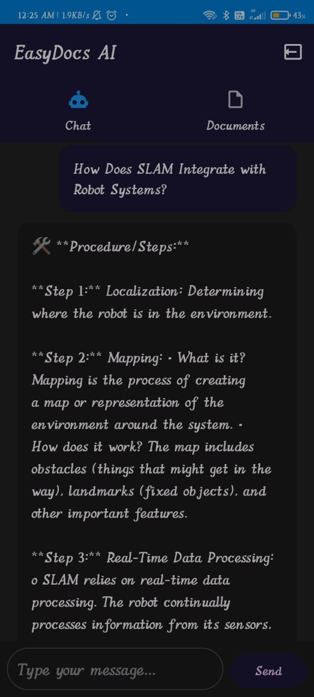
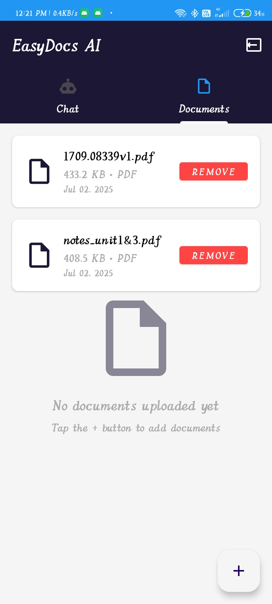
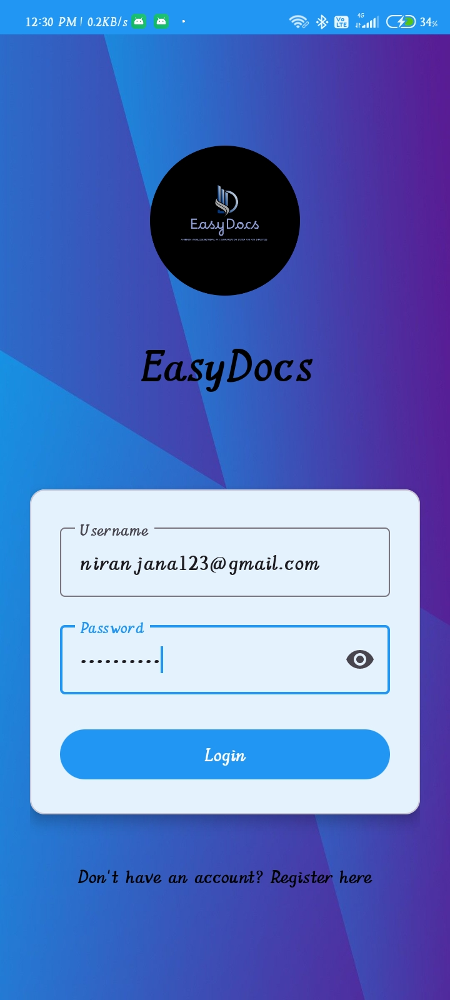
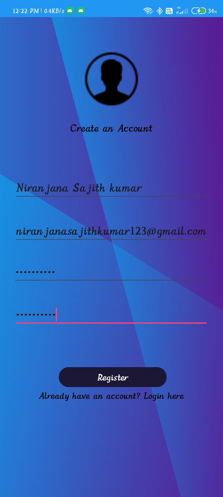

# EasyDocs: AI-Driven Knowledge Retrieval and Summarization System for New Employees

EasyDocs is an AI-powered Android application that allows users to upload documents and interact with them through a chatbot interface. It uses NLP and RAG (Retrieval-Augmented Generation) techniques to provide intelligent, context-aware responses from uploaded documents.

# ✨ Features
🔐 User Authentication – Register and login (locally or via Firebase)

📄 Document Upload – Upload PDF, DOCX, TXT files

🧠 AI Chatbot Interface – Ask questions based on your uploaded documents

📚 RAG + NLP Integration – Uses enhanced document retrieval and query analysis

🧾 Tab-based UI – Separate tabs for Chat and Document Management

📤 Dynamic Document Viewer – Manage uploaded documents easily

✅ Error Handling & User Feedback – Toasts and validations for smooth UX

# Technologies Used

Frontend: Android (Java) & Web (HTML/JS).

Backend: Flask (Python), Firebase Auth, Vector DB (ChromaDB).

AI: Custom RAG system and Genie AI for answers.

# 🚀 How It Works
1. Users register/login via Android interface.

2. Upload documents (PDF, DOCX, TXT).

3. Documents are processed and stored in memory (or Firebase).

4. Users ask questions — AI engine retrieves relevant text chunks and generates smart responses based on query type (definition, comparison, analysis, etc.).

## 📷 Screenshots

### 🔹 Chat Interface

### 🔹 Document Upload

### 🔹 Login Screen

### 🔹 Register Screen

